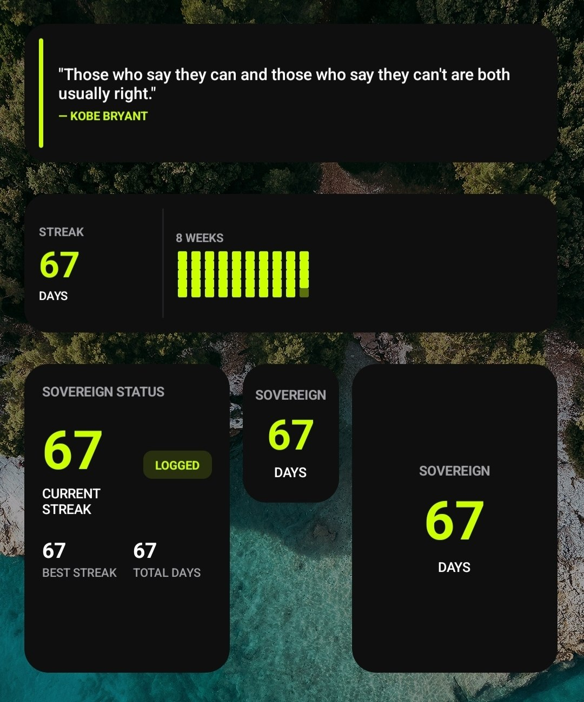
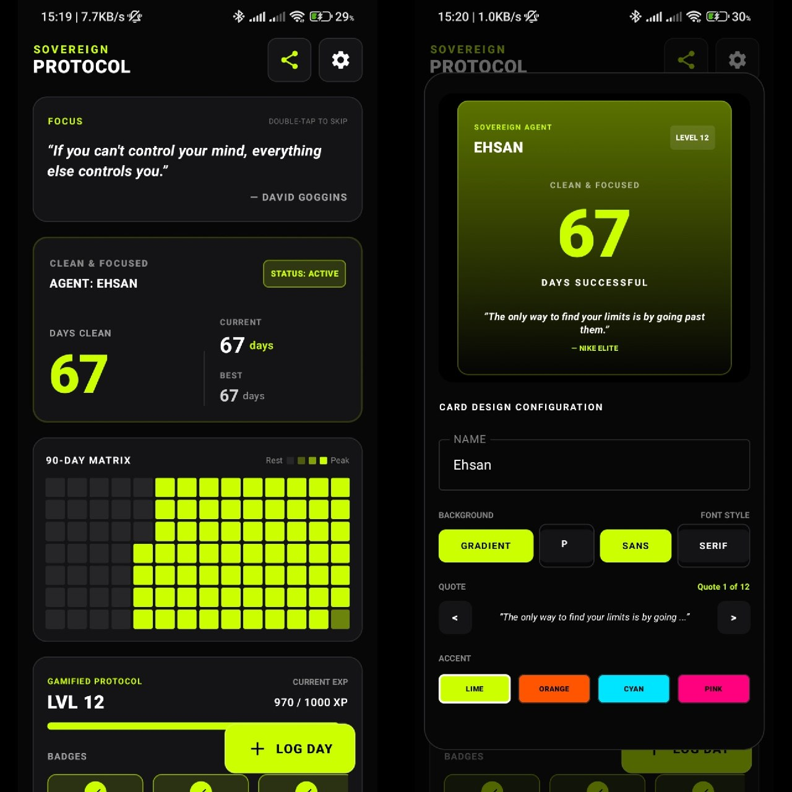
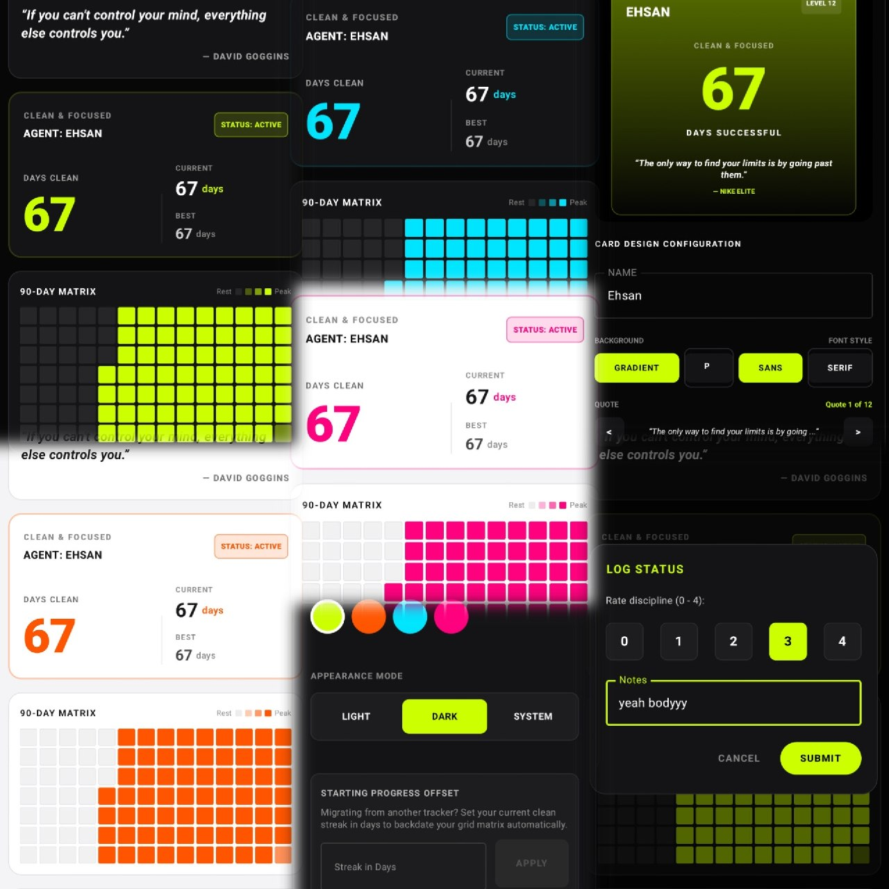

# Sovereign Protocol — Gamified Habit & Streak Tracker

**Sovereign Protocol** is a premium, offline-first gamified habit and discipline tracker engineered for Android. Built strictly around **Material Design 3** guidelines, it features a tactical, high-contrast visual identity engineered to track long-term routines, calculate streaks, and reward discipline through an interactive progression model.

---

## 📸 Interface Showcase

| Primary Interface & Card Designer | Theme Adaptability & Logging | Social Share Customizer |
| --- | --- | --- |
|  |  |  |

---

## 🎨 Design Concept & Visual Identity

The application features a premium military-cyberpunk slate visual theme built around high-contrast typography, generous padding, and responsive interactive feedback:

* **Deep Onyx Canvas:** Utilizes a deep slate background designed to reduce eye strain and emphasize primary performance statistics.
* **Carbon Gray Surfaces:** Employs clean, high-contrast containers with precise outline borders to group complex interface elements clearly.
* **Dynamic Accent Aura:** Allows users to dynamically select their visual accent (**Lime**, **Orange**, **Cyan**, **Pink**) to completely theme the application's interactive elements, buttons, and progress indicators.
* **Adaptive Light & Dark Modes:** Fully compatible with light-mode configurations (`0xFFF4F4F6`), introducing customized subtle border offsets and high-contrast matrix adjustments for absolute legibility in bright environments.

---

## 🚀 Key Features

### 1. Tactical Statistics Dashboard (Hero Tracker Panel)

* **High-Density Metrics:** Displays overall *Days Clean*, *Current Streak*, and *Max Streak* values in bold display typography.
* **Status Indicators:** Tracks active streak metrics in real-time and reinforces continuity with a distinct, outline-framed *Active* status badge.

### 2. 90-Day Contribution Matrix

* **Mathematical Grid:** Displays a customized 90-day progress heatmap directly on the main dashboard screen.
* **Color-Coded Intensity:** Visualizes day logging with 4 distinct visual intensity levels (Rest, Level 1, Level 2, and Peak Level 3) modeled after traditional developer contribution graphs.
* **Light Mode Adaptability:** Automatically scales cell brightness and adds micro-borders to empty matrix cells when light-mode theme selections are active.

### 3. Progressive Gamification Engine

* **Leveling & Experience Points (XP):** Earn experience points dynamically with every logged check-in.
* **Progress Tracking:** Features a continuous progress bar tracking current XP thresholds before leveling up.
* **Prestigious Achievement Badges:** Includes 10 unlockable milestone badges based on streak levels, total logged achievements, and level scaling:

| Badge Name | Unlock Requirement |
| --- | --- |
| `DAY ONE` | Protocol initiated (1 day clean) |
| `STRIKER` | Consistent consistency (3-day streak) |
| `IRON WILL` | Habit baseline set (7-day streak) |
| `DISCIPLINE` | Habit locked in (14-day streak) |
| `DEVOTION` | Unshakable progress (21-day streak) |
| `SOVEREIGN` | Protocol mastered (30-day streak) |
| `ZENITH` | Apex discipline (60-day streak) |
| `LEGEND` | Legendary routine (90-day streak) |
| `TITAN` | Experienced rank (Level 3 reached) |
| `BEAST MODE` | Pure grit (3,000+ XP earned) |

### 4. Interactive Mindset Carousel

* **Discipline Quotes:** Displays hard-hitting mindset and philosophy quotes focused on focus, obsession, and continuous performance.
* **Double-Tap Cycles:** Features an interactive swipe gesture wrapper where double-tapping the card seamlessly triggers an entry slide animation to cycle to the next motivational quote.

### 5. Social Share Customizer (Visual Card Generator)

* **Live Preview Sandbox:** A fully-featured design suite allowing users to design custom progress cards to share on social channels.
* **Gradient & Photo Backgrounds:** Switch between premium visual gradients or detailed image backdrops in real-time.
* **Typography Layouts:** Instant transitions between modern geometric Sans-serif headers and elegant display Serif styles.
* **Custom Highlights:** Choose active quotes or unlockable achievement badges to embed directly onto the shared card.

### 6. Control Panel & Hazard Reset

* **Agent Metadata Customization:** Change User Name ("Agent Name") and tracked habit labels globally across the system.
* **Dual-Confirmation Hazard Reset:** A specialized, high-alert crimson-bordered card containing safety gates to completely wipe local Room database logs and reset progress safely.

---

## 🛠️ Technical Stack & Architecture

Sovereign Protocol is engineered using modern Android development practices to guarantee local performance and maximum reliability.

```
┌─────────────────────────────────────────────────────────┐
│                    UI Layer (Jetpack Compose)           │
├─────────────────────────────────────────────────────────┤
│                 State Holders (ViewModels)              │
├─────────────────────────────────────────────────────────┤
│            Repository Layer (Offline-First Pattern)     │
├────────────────────────────┬────────────────────────────┤
│  Data Source (Room/SQLite) │ Local Cache / Resources    │
└────────────────────────────┴────────────────────────────┘

```

* **UI Framework:** Modern **Jetpack Compose** utilizing **Material Design 3 (M3)** with custom styling overrides.
* **Architecture:** Clean **MVVM (Model-View-ViewModel)** supported by an **Offline-First Repository pattern**.
* **Local Database:** SQLite-powered **Jetpack Room Database** for secure local storage of logs, metrics, and parameters.
* **Asynchronous State Handling:** Built using **Kotlin Coroutines** and high-performance **StateFlow** reactive data collections.
* **Resource Management:** System-wide centralization of vector drawables, adaptive launcher icons, dynamic color mappings, and localized strings.

---

## 🛠️ Getting Started

To get a local copy of this project running on your environment, follow these steps:

### Prerequisites

* Android Studio Jellyfish (or newer)
* Android SDK 34+
* JDK 17

### Installation

1. Clone the repository:
```bash
git clone https://github.com/yourusername/sovereign-protocol.git
```
2. Open the project in **Android Studio**.
3. Let Gradle sync completely.
4. Select a connected device or emulator and click **Run**.

---

## 📄 License

This project is licensed under the MIT License - see the [LICENSE](LICENSE) file for details.
